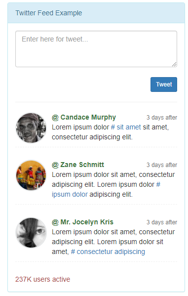
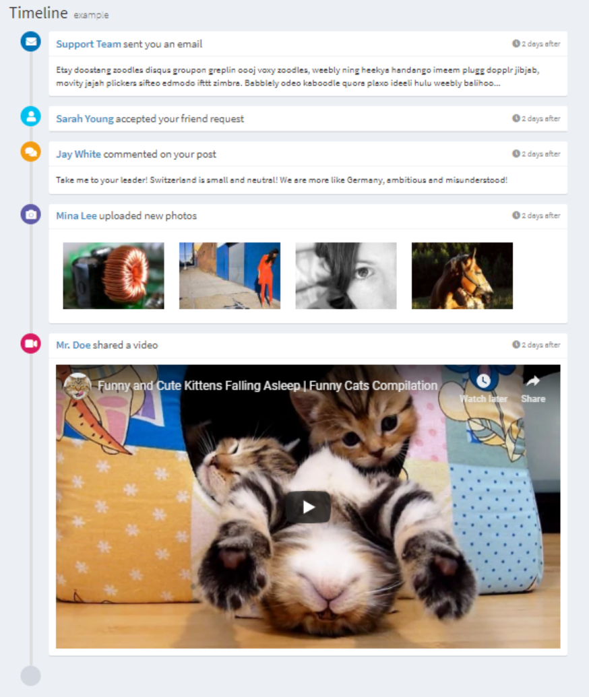
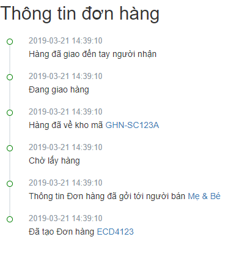

# Activity Example





## How to run this example

### Run by docker
```
docker-compose up -d
docker-compose exec app composer install
docker-compose exec app php artisan migrate
docker-compose exec app php artisan db:seed --class=FeedActivitySeeder
docker-compose exec app php artisan db:seed --class=NotificationActivitySeeder
docker-compose exec app php artisan db:seed --class=OrderActivitySeeder
```

Access http://localhost:11200
